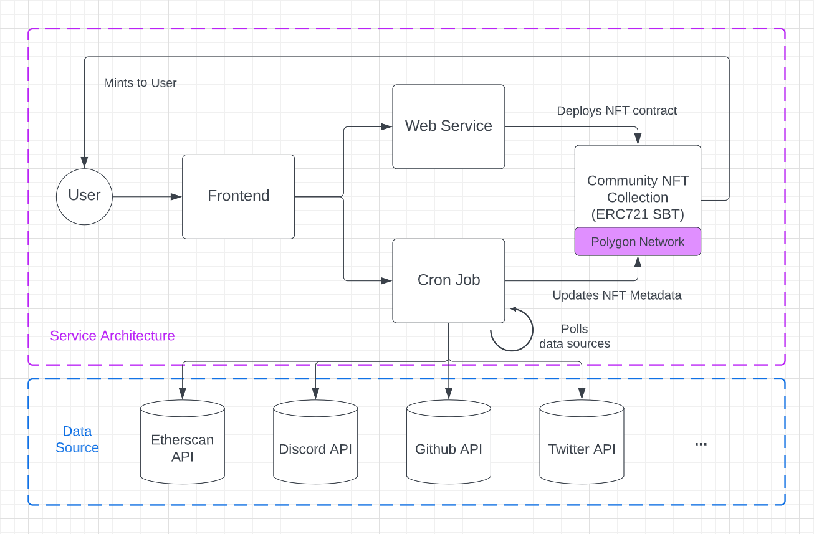

## Credly: Community NFT as a Service

_Take your web3 community's engagement to the next level._

Credly is a Community NFT-as-a-service platform powered by Polygon, providing an easy way for web3 communities to launch engagement NFTs. This project was built built for the Polygon BUIDL IT Hackathon.

- Read more about the submission [here](https://devpost.com/software/giftly-mopqin).
- Watch the demo video [here](https://vimeo.com/741907596).

### Architecture Diagram

### Tech Stack

- Polygon
- NextJS
- Express
- Firebase
- Ethers
- Hardhat
- IPFS (NFT.Storage)
- Third-Party API's (Etherscan, Discord, Github, Twitter)

### Related Repositories

- Credly Server: https://github.com/iamminci/credly-server
- Credly Cron Job: https://github.com/iamminci/credly-cron
- Credly Discord Listener: https://github.com/iamminci/credly-discord
- BUIDL IT DAO Website: https://github.com/iamminci/buidlitdao
