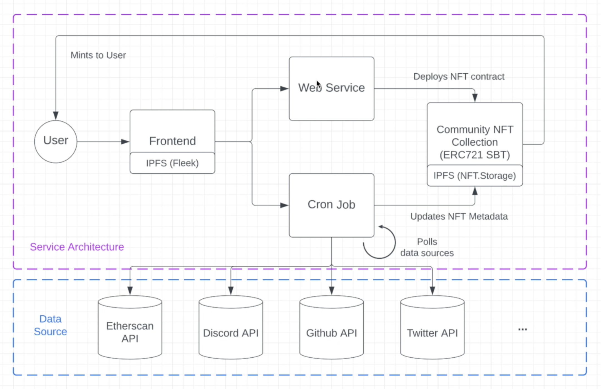

## Credly: Community NFT as a Service

_Take your web3 community's engagement to the next level._

This project was built as a submission to the Web3 Infinity Hackathon.

- Read more about the submission [here](https://devpost.com/software/credly).
- Watch the demo video [here](https://vimeo.com/740415729).

### Architecture Diagram

### Tech Stack

- NextJS
- Express
- Firebase
- Ethers
- Hardhat
- IPFS (Fleek, NFT.Storage)
- Third-Party API's (Etherscan, Discord, Github, Twitter)
